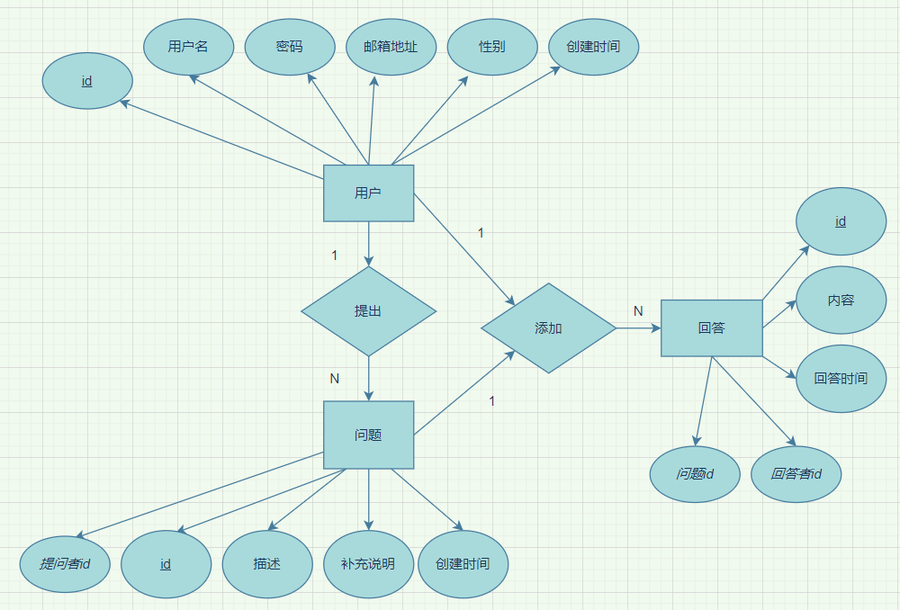
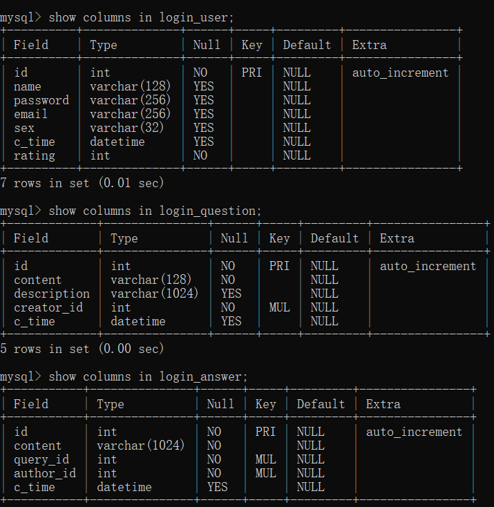

# 关于本站

本平台是一个简易问答平台。

用户在注册并登录以后，可以发布问题或对已有问题进行回答。

## 环境配置

平台采用Django框架进行搭建。在本机运行时，其他主机可通过局域网访问该平台。

本机相关环境如下：

- Windows 10
- python 3.8.8
- Django 3.2
- PyMySQL 1.0.2
- MySQL 8.0.23 for Win64 on x86_64

运行方式为：进入mysite目录，运行命令`python manage.py runserver`

## 功能简述

### 注册

用户输入昵称、邮箱、密码、确认密码、验证码后即可完成注册；

### 登录

用户输入昵称、密码、验证码后即可登录；

### 找回密码

如果忘记了密码，只需要提供正确的邮箱地址即可更换新的密码。

### 提问

用户在登录后可以发布问题或删除自己提出的问题，并且可以看到其他用户发布的问题。

### 回答

在每个问题下，用户可以创建回答和删除自己写过的回答。每个用户在一个问题下可以创建多个回答。

### 积分排行

用户每提出一个问题记1分，每回答一个问题记3分。所有用户分数从高到低显示在排行榜上。

### 查看简介

在导航栏点击“关于本站”即可（未登录也可查看）。

### 摸鱼（不是）

在你没有登录的情况下，可以在主页玩“生命游戏”。

## 数据库设计

数据库共有3张表——用户、问题和回答。

其ER图如下所示：（标下划线的为主键）

每个表的具体列名及相关信息如下：

## 技术难点

- html+css+js的语法

- html与python的交互
- Django的ORM操作

## 参考资料

https://www.django.cn/article/show-15.html

https://blog.csdn.net/laikaikai/article/details/80563387

https://docs.djangoproject.com/en/3.2/

